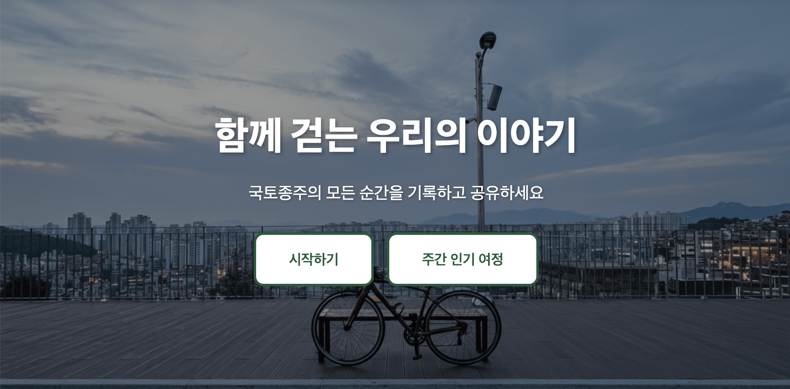
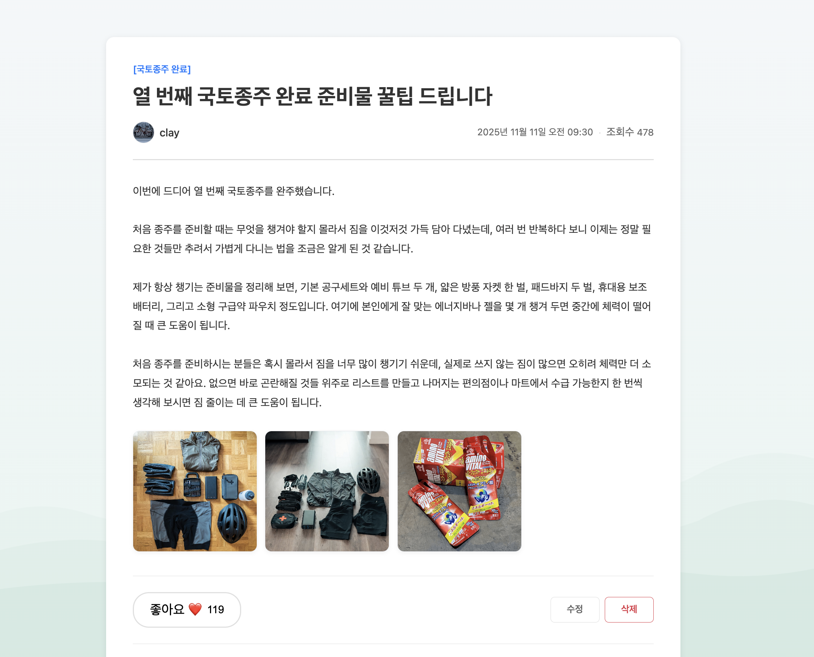

# 종주메이트
국토종주는 하루하루 다른 풍경을 마주하며, 함께 달리는 이들과의 순간을 기록하고 공유하는 여정 그 차제입니다.

이 곳은 국토종주를 사랑하는 사람들이 서로의 경험을 나누고, 정보를 얻고, 다시 길 위로 함께 나서는 공간입니다.

## 서비스 소개

### 이런 분들을 위한 커뮤니티에요!
- 처음 국토종주에 도전해보고 싶지만 정보가 부족한 예비 도전자
- 4대강종주 완주 도장을 모으는 라이더
- 여행 중 만난 감동적인 순간을 나누고 싶은 사람
- 코스, 보급, 숙소 팁 등 실전 정보를 공유하고 싶은 베테랑

### 커뮤니티에서 할 수 있는 것

이미지와 함께 공유 가능


- 국토종주 코스별 꿀팁 공유
- 여행 중 찍은 사진 기록
- 장비 추천 및 정비 팁
- 라이딩 파트너 모집
- 라이더들의 자유로운 일상/대화

### 프로젝트 영상
[](https://youtu.be/wcZGfpMFt_s)

---
## 프로젝트 설명 

### 개발 인원 및 기간
- 개발 기간: 2025.09.15 ~ 2025.12.09
- 개발 인원: 1인 개인프로젝트

### 기술 스택
- Backend
    - Java 21
    - Spring Boot 3.5.6
    - MySQL
- AWS
    - S3
    - ECR
    - SSM
- CI/CD
    - GithubActions

## 대용량 테스트 데이터 생성

부하 테스트를 위한 대용량 더미 데이터를 JDBC Batch Insert 방식으로 생성할 수 있습니다.

### 생성되는 데이터 구성
- **User**: 10,000명
- **Post**: 1,000,000건
- **PostStatus**: 1,000,000건 (각 Post마다)
- **Comment**: 2,000,000건 (평균 Post당 2개)
- **PostLike**: 5,000,000건 (평균 Post당 5개)
- **CommentLike**: 1,000,000건 (평균 Comment당 0.5개)
- **Image**: 300,000건
- **PostImage**: 300,000건 (30%의 Post가 이미지 포함)

### 사용 방법

#### 1. 로컬 환경에서 실행

```bash
# 1. application.yaml 설정 변경
data:
  generator:
    enabled: true  # false에서 true로 변경

# 2. 애플리케이션 실행
./gradlew bootRun

# 3. 데이터 생성 완료 후 다시 false로 변경
data:
  generator:
    enabled: false
```

#### 2. 서버 환경에서 실행

**RDS 접근 가능한 서버(EC2/Bastion)에서 실행:**

```bash
# 1. 환경 변수로 설정하여 실행
java -jar -Ddata.generator.enabled=true community.jar

# 또는 application.yaml 직접 수정 후 실행
```

### 주의사항
- **기존 데이터가 있으면 생성을 건너뜁니다** (users 테이블 기준으로 확인)
- **데이터베이스 용량을 충분히 확보하세요** (약 5~10GB 필요)
- **생성 소요 시간: 로컬 환경 기준 약 10~30분**
- Private RDS 환경에서는 RDS에 접근 가능한 서버에서 실행해야 합니다
- 성능 최적화를 위해 `rewriteBatchedStatements=true` 옵션이 적용되어 있습니다

### 성능 최적화 설정
`application.yaml`에 다음 설정이 적용되어 있습니다:

```yaml
spring:
  datasource:
    url: jdbc:mysql://localhost:3306/community?serverTimezone=UTC&useSSL=false&rewriteBatchedStatements=true
    hikari:
      maximum-pool-size: 20
      minimum-idle: 10
```

## 시스템 아키텍쳐
<이미지 넣기>

### EC2
- FrontEnd
