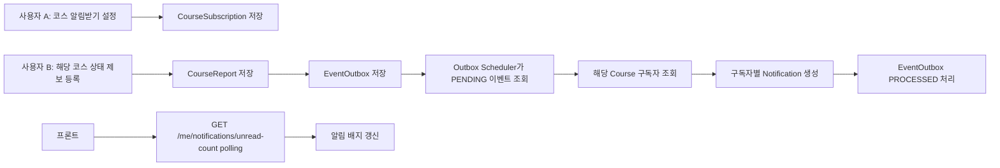
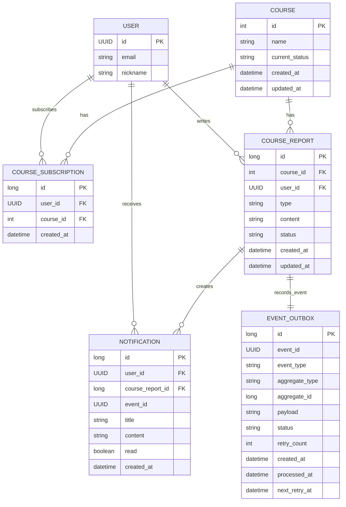
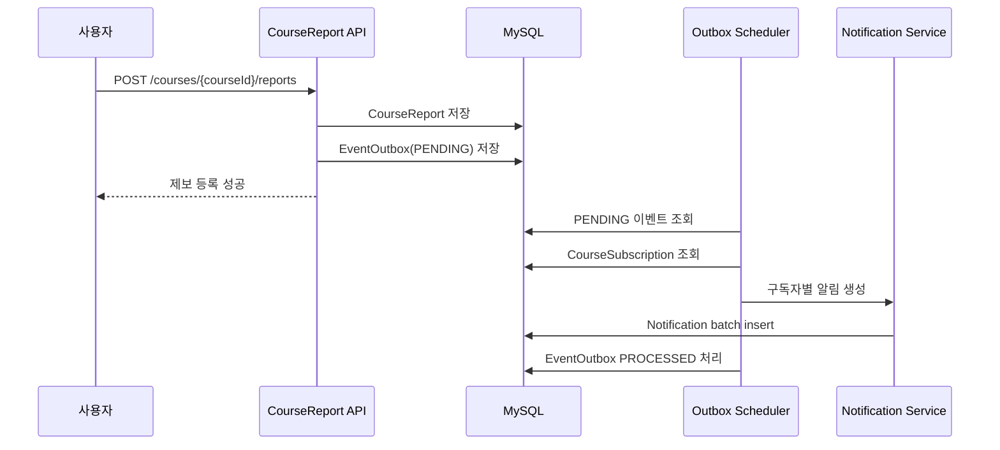
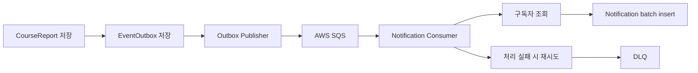
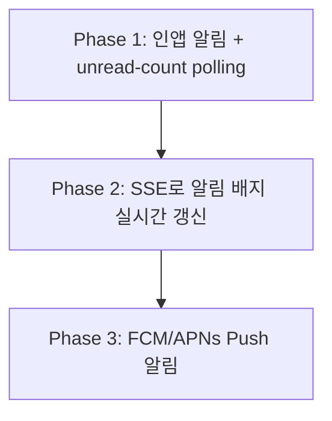

# 코스 제보 인앱 알림 서비스 설계

## 1. 목적

`코스 현황` 기능에서 사용자가 특정 코스를 `알림받기`로 설정해두면, 해당 코스에 새로운 상태 제보가 등록될 때 구독자들에게 인앱 알림을 생성한다.

MVP에서는 외부 푸시, 이메일, 문자 발송은 제외하고 서비스 내부 알림함에서 확인하는 `인앱 알림`으로 시작한다.

핵심 목표는 다음과 같다.

- 제보 등록 API 응답 시간이 구독자 수에 선형으로 증가하지 않도록 한다.
- 제보 저장과 알림 생성을 분리한다.
- 이벤트 재처리 시 중복 알림이 생성되지 않도록 멱등성을 보장한다.
- 처음에는 작은 인프라로 시작하고, 부하를 측정하며 MQ 기반 구조로 확장한다.

## 2. 인앱 알림 정의

인앱 알림은 앱/웹 서비스 안에서만 확인하는 알림이다.

예시:

```text
[코스 제보 알림]
한강종주에 새로운 공사 제보가 등록되었습니다.
```

인앱 알림은 휴대폰 푸시 알림이나 이메일이 아니다.

| 구분 | 설명 | 이번 MVP 포함 여부 |
|---|---|---|
| 인앱 알림 | 서비스 알림함, 마이페이지에서 조회 | 포함 |
| 푸시 알림 | 앱을 꺼도 휴대폰에 뜨는 알림, FCM/APNs 필요 | 제외 |
| 이메일 알림 | 메일 발송 | 제외 |

프론트는 처음에는 다음 방식으로 알림을 확인한다.

```text
1. 백엔드가 Notification 테이블에 알림 저장
2. 프론트가 15~30초마다 unread count API polling
3. 새 알림이 있으면 종 아이콘 배지 숫자 변경
4. 사용자가 알림함을 열면 알림 목록 조회
```

실시간성이 더 필요해지면 `Polling → SSE → Push` 순서로 확장한다.

## 3. 전체 흐름



## 4. 도메인 모델



## 5. 주요 테이블과 제약 조건

### CourseSubscription

사용자가 특정 코스를 알림받도록 설정한 상태다.

필수 제약:

```text
unique(user_id, course_id)
```

이유:

- 같은 사용자가 같은 코스를 중복 구독하지 않도록 막는다.
- 알림받기 버튼 연속 클릭이나 네트워크 재시도에도 구독 정보는 1건만 유지한다.

필수 인덱스:

```text
course_subscriptions(course_id)
```

이유:

- 제보가 등록된 코스의 구독자를 빠르게 조회하기 위함이다.

### Notification

사용자별 인앱 알림이다.

필수 제약:

```text
unique(event_id, user_id)
```

이유:

- Outbox 이벤트가 중복 처리되어도 같은 사용자에게 같은 알림이 2번 생성되지 않도록 한다.

필수 인덱스:

```text
notifications(user_id, read, created_at)
```

이유:

- 내 알림 목록 조회와 안 읽은 알림 개수 조회를 빠르게 처리하기 위함이다.

### EventOutbox

DB 저장과 비동기 이벤트 처리를 연결하는 테이블이다.

필수 인덱스:

```text
event_outbox(status, next_retry_at, created_at)
```

이유:

- Scheduler가 처리 가능한 `PENDING` 이벤트를 빠르게 조회하기 위함이다.

## 6. API 초안

### 코스 알림받기 등록

```http
POST /courses/{courseId}/subscription
```

처리:

```text
1. 사용자 인증 확인
2. Course 존재 여부 확인
3. CourseSubscription 생성
4. 이미 구독 중이면 성공으로 처리하거나 409 대신 현재 상태 반환
```

### 코스 알림받기 취소

```http
DELETE /courses/{courseId}/subscription
```

처리:

```text
1. 사용자 인증 확인
2. CourseSubscription 삭제
3. 이미 구독이 없어도 성공으로 처리 가능
```

### 상태 제보 등록

```http
POST /courses/{courseId}/reports
```

요청 예시:

```json
{
  "type": "CONSTRUCTION",
  "content": "강변 진입로 일부 공사 중입니다. 우회가 필요합니다."
}
```

처리:

```text
1. CourseReport 저장
2. Course current_status 갱신
3. ReportCreatedEvent를 EventOutbox에 저장
4. 트랜잭션 커밋
5. 응답 반환
```

### 안 읽은 알림 개수 조회

```http
GET /me/notifications/unread-count
```

프론트는 이 API를 15~30초마다 polling해서 알림 배지를 갱신한다.

### 내 알림 목록 조회

```http
GET /me/notifications?cursor={cursor}&size={size}
```

커서 기반 페이지네이션을 사용한다.

### 알림 읽음 처리

```http
PATCH /me/notifications/{notificationId}/read
```

본인의 알림만 읽음 처리할 수 있다.

## 7. 1단계 구현: DB Outbox + Scheduler

처음부터 MQ를 도입하지 않고 DB Outbox와 Scheduler로 시작한다.

선택 이유:

- 운영 인프라가 작다.
- 로컬 개발과 테스트가 쉽다.
- 현재 MVP는 외부 시스템 간 대규모 이벤트 스트리밍보다 제보 후 알림 생성이 핵심이다.
- Outbox 패턴 자체만으로도 dual-write 문제와 멱등성 설계를 보여줄 수 있다.

처리 방식:



Scheduler 구현 기준:

```text
1. fixedDelay로 PENDING 이벤트 조회
2. 처리 대상 이벤트를 PROCESSING으로 선점
3. courseId 기준 구독자 조회
4. 구독자별 Notification 생성
5. 성공 시 PROCESSED
6. 실패 시 retry_count 증가, next_retry_at 갱신
7. 최대 재시도 초과 시 FAILED
```

다중 Scheduler를 고려하면 `SELECT ... FOR UPDATE SKIP LOCKED` 또는 상태 선점 방식으로 같은 이벤트를 동시에 처리하지 않도록 한다.

## 8. 2단계 확장: AWS SQS + DLQ

Outbox 처리 지연이나 DB 부하가 커지면 SQS로 확장한다.

확장 조건 예시:

```text
Outbox pending 이벤트가 지속적으로 누적
알림 생성 지연 p95가 5초 초과
Notification batch insert 중 DB connection pending 증가
Scheduler 단일 워커 처리량 한계 도달
```

확장 후 흐름:



SQS를 먼저 고려하는 이유:

- AWS 기반 프로젝트와 잘 맞는다.
- 운영 복잡도가 Kafka보다 낮다.
- 알림 생성은 순서 보장보다 재시도, DLQ, 수평 확장이 중요하다.
- MVP 규모에서 Kafka보다 도입 이유를 방어하기 쉽다.

알아야 할 SQS 개념:

```text
Visibility Timeout
Message Retention
Receive Count
DLQ
Redrive
Standard Queue 중복 가능성
FIFO Queue 순서 보장과 처리량 제한
```

이번 기능은 Standard Queue + Consumer 멱등성을 기본으로 고려한다.

## 9. 3단계 확장: SSE 또는 Push

프론트 실시간성이 더 필요해지면 polling에서 SSE로 확장한다.

확장 순서:



비교:

| 방식 | 특징 | 적용 시점 |
|---|---|---|
| Polling | 구현이 쉽고 MVP에 적합 | 1차 |
| SSE | 서버가 브라우저로 단방향 이벤트 전송 | 알림 실시간성이 필요할 때 |
| WebSocket | 양방향 통신 | 채팅처럼 상호작용이 필요할 때 |
| Push | 앱을 꺼도 알림 가능 | 모바일 앱/외부 알림이 필요할 때 |

알림 배지 정도는 WebSocket보다 SSE가 단순하다.

## 10. 실패와 재시도 정책

비동기 처리는 실패와 중복 처리를 전제로 설계한다.

실패 가능 상황:

- Scheduler 처리 중 서버 종료
- DB 일시 장애
- 커넥션 풀 부족
- 잘못된 payload
- 알림 batch insert 중 일부 실패

정책:

```text
일시 실패: retry_count 증가 후 next_retry_at 기준 재시도
반복 실패: FAILED 상태 또는 DLQ로 격리
중복 처리: unique(event_id, user_id)로 방지
알림 생성 기준: Consumer 처리 시점의 구독 상태 기준
```

구독 취소 정책:

```text
MVP에서는 Consumer 처리 시점의 구독 상태를 기준으로 알림을 생성한다.
제보 등록 후 Consumer가 처리하기 전에 구독을 취소한 사용자는 알림 대상에서 제외된다.
이벤트 발생 시점 기준 알림이 필요해지면 Outbox payload에 구독자 스냅샷을 저장하는 방식으로 확장한다.
```

## 11. 부하 테스트와 측정 기준

작은 구조로 시작하되, 부하를 주며 확장 기준을 판단한다.

부하 테스트 시나리오:

```text
1. 특정 코스에 구독자 100명 생성
2. 제보 1건 등록
3. 제보 등록 API p95 측정
4. Notification 100건 생성 완료 시간 측정
5. 같은 시나리오를 1,000명, 10,000명으로 확대
```

측정 지표:

```text
POST /courses/{courseId}/reports p95
GET /me/notifications/unread-count p95
Outbox pending count
Outbox 처리 지연 p95
Notification 생성 처리량
중복 Notification 생성 수
EventOutbox FAILED 수
DB connection active/pending
```

목표:

```text
제보 등록 API p95 < 300ms
알림 생성 지연 p95 < 5s
중복 Notification 0건
FAILED 이벤트는 추적 가능해야 함
```

## 12. 테스트 계획

기능 테스트:

- 코스 알림받기 등록
- 코스 알림받기 취소
- 상태 제보 등록 시 CourseReport 저장
- 상태 제보 등록 시 EventOutbox 저장
- Scheduler 처리 후 구독자별 Notification 생성
- 내 알림 목록 조회
- 안 읽은 알림 개수 조회
- 알림 읽음 처리

동시성 테스트:

- 같은 사용자가 같은 코스에 동시에 알림받기 요청해도 CourseSubscription은 1건만 생성된다.
- 같은 Outbox 이벤트를 여러 워커가 처리하려 해도 Notification은 중복 생성되지 않는다.
- 같은 eventId가 재처리되어도 unique(event_id, user_id)로 사용자별 알림은 1건만 유지된다.

회귀 방지:

- Notification 생성 수가 구독자 수와 일치하는지 검증한다.
- 제보 등록 API에서 알림 생성 로직을 직접 수행하지 않는지 검증한다.
- 읽음 처리 시 다른 사용자의 알림을 수정할 수 없는지 검증한다.

## 13. 면접에서 알아야 할 핵심 개념

### 비동기 처리

제보 저장은 사용자 요청의 핵심 작업이라 동기 처리하고, 알림 생성은 부가 작업이라 비동기로 분리한다.

면접 답변:

```text
구독자가 많아질수록 알림 생성 비용이 커지므로 제보 등록 API 안에서 모든 알림을 만들면 응답 시간이 증가합니다.
그래서 제보 저장과 알림 생성을 분리해 요청 응답 시간을 안정화했습니다.
```

### Transactional Outbox

DB 저장과 메시지 발행은 서로 다른 시스템이라 원자적으로 묶기 어렵다.

Outbox를 쓰지 않으면 다음 문제가 생길 수 있다.

```text
CourseReport 저장 성공, MQ 발행 실패
→ 제보는 있는데 알림 이벤트가 없음

MQ 발행 성공, DB 트랜잭션 rollback
→ 실제 제보는 없는데 알림 이벤트만 있음
```

Outbox는 제보와 이벤트를 같은 DB 트랜잭션에 저장해 dual-write 문제를 줄인다.

### 멱등성

Outbox나 MQ는 같은 이벤트를 여러 번 처리할 수 있다고 가정한다.

따라서 Consumer는 중복 호출되어도 결과가 한 번 처리된 것처럼 유지되어야 한다.

이번 설계에서는 다음 제약으로 보장한다.

```text
Notification unique(event_id, user_id)
```

### 메시지 처리 보장

| 방식 | 의미 | 특징 |
|---|---|---|
| At-most-once | 최대 한 번 처리 | 유실 가능 |
| At-least-once | 최소 한 번 처리 | 중복 가능 |
| Exactly-once | 정확히 한 번 처리처럼 보장 | 구현 복잡 |

이번 설계는 `at-least-once + 멱등 Consumer`로 정확히 한 번 처리된 것에 가까운 결과를 만든다.

### Polling, SSE, WebSocket, Push

| 방식 | 특징 |
|---|---|
| Polling | 주기적으로 서버에 물어봄, 구현 쉬움 |
| SSE | 서버가 클라이언트로 단방향 이벤트 전송 |
| WebSocket | 양방향 실시간 통신 |
| Push | 앱을 꺼도 알림 가능, FCM/APNs 필요 |

MVP는 polling으로 시작하고, 실시간성이 필요해지면 SSE를 붙인다.

## 14. 이력서 문장

```text
코스 상태 제보 등록과 구독자 알림 생성을 분리하기 위해 Transactional Outbox 기반 인앱 알림 구조를 설계했습니다.
제보 저장과 이벤트 저장을 같은 트랜잭션으로 묶어 dual-write 문제를 줄였고, eventId와 userId 유니크 제약으로 재처리 시 중복 알림 생성을 방지했습니다.
초기에는 DB Outbox + Scheduler로 작게 시작하고, 부하 증가 시 SQS + DLQ와 Consumer 수평 확장으로 전환할 수 있도록 설계했습니다.
```
